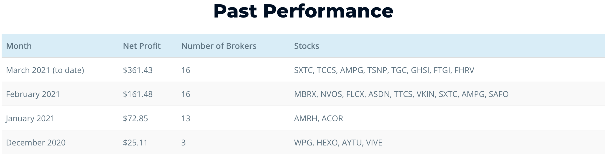

# Reverse Stock Split Arbitrage



Reverse Stock Split Arbitrage is a method by which an investor purchases 1 share of a company that is expected to offer a reverse stock split in the hopes of receiving "rounded up" shares following the stock consolidation. 

It is best explained by @reverseSplitArbitrage:

> Say a company needs to increase share price, often to stay listed on an exchange. To do this, they announce that 10 shares will now be consolidated into 1 share, which has the effect of increasing the price per share about 10x. (The exact ratio may differ.) So if you had 10 shares before the split, you’d now have 1 share that’s worth ten times as much. That’s a reverse split.

> But what if you only had 1 share to begin with? Now you’d have 1/10 of a share, a fraction which historically could not be traded. To get around fractional shares, companies will sometimes pay you the cash value of the fractional share. Other times, though, they will round you up to one full share. When they round up, the share you had bought for $0.50 is now worth around $5. You profit $4.50 with almost no risk. This is reverse split arbitrage.

For more information, check out the [reverse split arbitrage](https://www.reversesplitarbitrage.com/) website, which is run by [@reverseSplitArb](https://twitter.com/reverseSplitArb)

This package automates the process of buying and selling these stocks on as many brokerage accounts as possible.

## How it works

1. Whenever @reverseSplitArb tweets, a post request is made to Google Cloud Functions. (This can be set up using IFTTT or a custom tweepy listener).
2. Google Cloud Functions runs `main.py` which purchases the stock mentioned in the tweet on all supported brokers.
3. When a reverse stock split happens, our accounts should have rounded up shares that we previously bought.
4. When @reverseSplitArb tweets again to signal that the stock split happened as expected, our google cloud functions runs again and sell the shares.
5. Profit!

## Currently supported brokers

* **Robinhood**: requires setting up multifactor authentication
  * Sign into your robinhood account and turn on two factor authentication. Robinhood will ask you which two factor authorization app you want to use. Select "other". Robinhood will present you with an alphanumeric code. This is your `MFA TOKEN`. Make sure to put this into Google Authenticator, Duo, or an authenticator of your choice.
* **Alpaca**: requires secret and public access key (available on the dashboard)
* **Webull**: requires access token, refresh token, token expiration, UUID, and trade token (follow [this guide](https://github.com/tedchou12/webull/wiki/MFA-&-Security))
* **Webull** (second account) - WeBull allows for two accounts (one margin, one cash)
* **Ally Invest** (Untested, but should work in practice) - Follow the instructions [here](https://alienbrett.github.io/PyAlly/installing.html#get-the-library) to get credentials.

### Work in progress
* **Schwab**: using puppeteer since no public API exists
* **Vanguard**: using puppeteer since no public API exists
* **Tradier**: they have a nice API but no client library and its not confirmed if they round up yet
* **TradeStation**: this might require puppeteer because of their strict API eligibility requirements but I've emailed them to try to find a way around this

## Getting set up

First, we need to get our credentials set up. Run `python main.py --setup` and follow the prompts to save your credentials to `.env` so we're able to place orders.

If you'd prefer to set the environment variables yourself, the script requires the following environment variables set:
```
RH_MFA_TOKEN # The robinhood MFA token found under the security section of your account
RH_USERNAME
RH_PASSWORD
ALPACA_ACCESS_KEY_ID # Alpaca's access key id
ALPACA_SECRET_ACCESS_KEY # Alpaca's secret key
WB1_ACCESS_TOKEN # webull
WB1_REFRESH_TOKEN # webull
WB1_TOKEN_EXPIRATION # webull
WB1_UUID # webull
WB1_TRADE_TOKEN # six digit trading pass code for webull
WB2_ACCESS_TOKEN # webull
WB2_REFRESH_TOKEN # webull
WB2_TOKEN_EXPIRATION # webull
WB2_UUID # webull
WB2_TRADE_TOKEN # six digit trading pass code for webull
ALLY_ACCOUNT_NBR=
ALLY_CONSUMER_KEY
ALLY_CONSUMER_SECRET
ALLY_OAUTH_SECRET
ALLY_OAUTH_TOKEN
```

Once you've got credentials set up, you can call the script by running `python main.py --tweet text of the message goes here`. For example, `python main.py --dryrun --tweet "I'm buying 4 shares of \$TSLA"` will trigger the script to do a dryrun attempt to buy 4 shares of TSLA on all accounts linked. Note that the dollar sign had to be escaped because bash interprets `$TSLA` as a variable.

## To Do

* Add a Tweepy listener to this repo so that anyone can run the entire process on their local machine without having to set anything else up (like GCP/IFTTT)
* Set up this script as a package that can be installed and used from the commandline or programmatically
* Add more brokers 
* Add a front end to show returns/results
* Find stock splits using an API rather than a twitter account

### Future broker support

Currently, I've investigated APIs for these brokerages:
* Tradier - Unclear if this broker rounds up but the API is very nice, implementation in progress
* Vanguard - No official/unofficial API, automation using puppeteer in progress
* Schwab - No official/unofficial API, automation using puppeteer in progress
* SoFi - No official/unofficial API, might be able to use puppeteer or reverse engineer network requests.
* Tastyworks -- Unofficial API doesn't support equity trading
* ~~TradeStation~~ -- API use requires a $10k deposit so this is a no go until I'm rich
* ~~Firstrade~~ - It seems like an unofficial API might exist but they don't approve US residents with Canadian citizenship (for some reason) so I can't test this
* ~~Dough~~ - Mobile only, does not offer an API
* ~~All of Us~~ - Mobile only, does not offer an API
* ~~Public~~ - Mobile only, does not offer an API
* ~~Fidelity~~ - No official/unofficial API, security detects and blocks puppeteer
